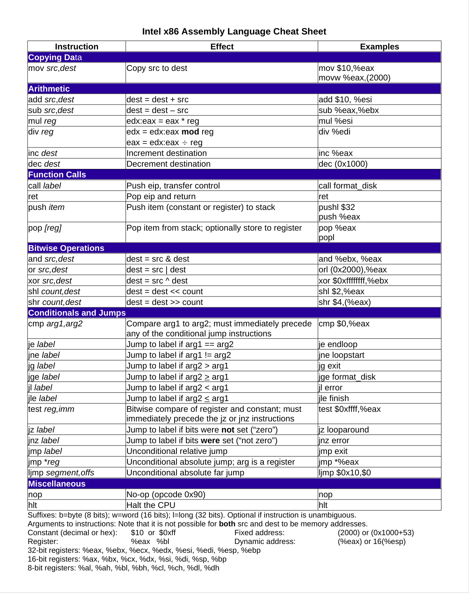

# Reverse_Engineering
Actvitiy introducing reverse engineering concepts and tools.

## Getting Started 
To get started with this activity you'll want some sort of disassembler  

### Windows   
If using Windows you can install [x64dbg](https://x64dbg.com/). <b>(I recommend this option. I am the most familiar with this tool.)</b>  

### Linux
If you have a Kali VM you already have access to [radare2](https://rada.re/n/) or you can download [Ghidra](https://ghidra-sre.org/).

### Browser Based
Here is an online tool if you don't want to download one:  [netdis](https://netdis.org/)  
<b>Note: recently I have been having trouble uploading files here. If you run into issues refer to one of the options above.</b>

## The Challenges  
There are 4 total challenges with each one ramping up in difficulty. Each of the challenges asks for a password and your goal is to succesfully get past that check. Not every challenge has a hardcoded password so you'll have to do a little thinking to solve them.   
  
-easyPython.py: This is the first one you should start with. It is relatively simple to figure out and a good look at reversing from source code.  
  
-easyC.exe: This is where you will need to bust out your disassembler. <b>Warning! Disassembly can look scary if you have never done this before. The best advice I can give you is to not get stuck by individual lines of code. Just try to get an idea of how the program flows at first.</b> Hint: This challenge DOES have a hardcoded password.
    
-mediumC.exe: This one is a real step up in difficulty. You may have to resort to bypassing the password checks entirely. Hint: This challenge is very similar to the python challenge.  
    
-hardC.exe: The last in the lineup. If you've managed to get this far then know it isn't huge step up from the last challenge. A password IS hardcoded but it is obfuscated.  

## Assembly Instruction Cheat Sheet
  
## Great Resources  
Reverse engineering game: [microcorruption](https://microcorruption.com/)  
Site used to share programs designed to be reversed: [crackmes](https://crackmes.one/)